

## About

Computer Science Dual Degree (B.Tech + M.Tech) student at IIT Kharagpur (Class of 2027).

 

## Quantitative Finance

<table>
<tr><td>

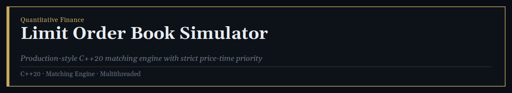

**[Limit Order Book Simulator](https://github.com/deepesh1singh/Limit-Order-Book-Matching-Engine)**

A production-style C++20 matching engine simulating electronic exchange mechanics under strict price-time priority. Supports multiple order types, full order lifecycle management, self-trade prevention, multithreaded order processing, historical replay, live statistics, and validation through fuzz testing and sanitizer-based checks.

</td></tr>
<tr><td>

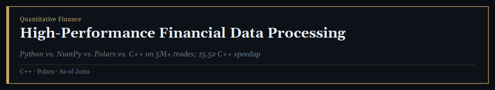

**[High-Performance Financial Data Processing](https://github.com/deepesh1singh/High-Performance-Financial-Data-Processing)**

A benchmark comparing Pure Python, NumPy, Polars, and C++ for processing millions of financial market records, evaluating as-of joins and trading analytics on datasets up to 5M trades. Uses isolated subprocess timing and cross-implementation correctness validation; the C++ implementation achieved a 15.5&times; reduction in execution time and 3.7&times; lower memory usage than pure Python at 2M trades.

</td></tr>
</table>

 

## Machine Learning & Research

<table>
<tr><td>

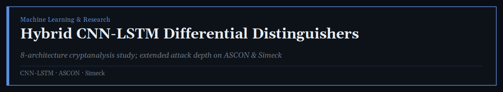

**[Hybrid CNN-LSTM Differential Distinguishers for Ciphers](https://github.com/deepesh1singh/Hybrid-CNN-LSTM-differential-distinguisher-for-ASCON-ACE-SIMECK-LLBC-and-future-ciphers)**

Developed and evaluated eight neural architectures for differential cryptanalysis of the ASCON permutation, then designed a hybrid CNN&ndash;LSTM distinguisher reaching 6 rounds for ASCON, ACE, and FUTURE, 19 rounds for Simeck, and 10/4 rounds for LLBC-128/256. The model extended attack depth from 4 to 6 rounds on ASCON and from 12 to 19 rounds on Simeck, outperforming existing neural-based distinguishers on both ciphers.

</td></tr>
<tr><td>

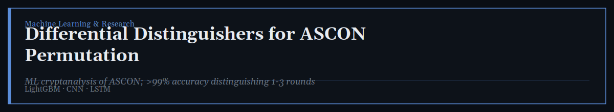

**[Differential Distinguishers for ASCON Permutation](https://github.com/deepesh1singh/Differential-distinguishers-for-ASCON-permutation)**

Investigates machine-learning-based cryptanalysis of the ASCON lightweight cryptographic permutation, training and comparing LightGBM, CNN, and LSTM models to distinguish differential ciphertext pairs from random pairs across 1&ndash;5 rounds &mdash; achieving over 99% test accuracy for 1&ndash;3 rounds.

</td></tr>
<tr><td>

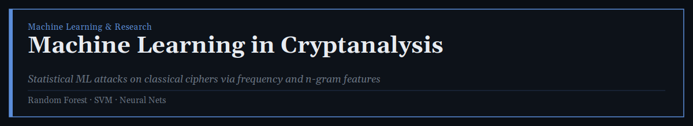

**[Machine Learning in Cryptanalysis](https://github.com/deepesh1singh/ML-Cryptanalysis)**

Applies machine learning and statistical pattern recognition to analyze classical ciphers such as Caesar, Vigen&egrave;re, and substitution ciphers. Generates encrypted datasets, extracts character-frequency and n-gram features, and trains Random Forest, SVM, and Neural Network models to identify cipher patterns.

</td></tr>
<tr><td>

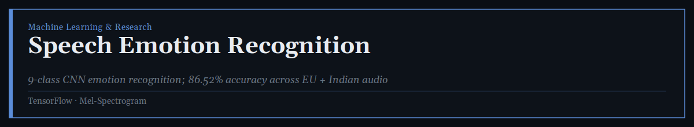

**[Speech Emotion Recognition](https://github.com/deepesh1singh/Speech-Emotion-Recognition-using-CNN-on-Cross-Cultural-Audio-Data)**

A TensorFlow-based CNN system classifying speech into 9 emotion categories using European and Indian audio datasets. Uses Mel-spectrogram feature extraction, actor-aware data splitting, augmentation, and mixed-precision training &mdash; achieving 86.52% test accuracy and a 0.89 macro F1-score on 653 test samples.

</td></tr>
<tr><td>

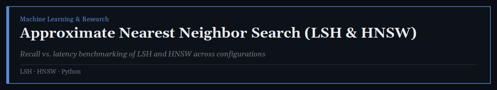

**[Approximate Nearest Neighbor Search (LSH & HNSW)](https://github.com/deepesh1singh/Approximate-Nearest-Neighbor-Search-Implementation-with-LSH-and-HNSW)**

Implements and evaluates ANN search using Locality-Sensitive Hashing and Hierarchical Navigable Small World graphs in Python, comparing approaches on Recall@5/10/15 and query latency to analyze the accuracy&ndash;speed trade-off across configurations.

</td></tr>
<tr><td>

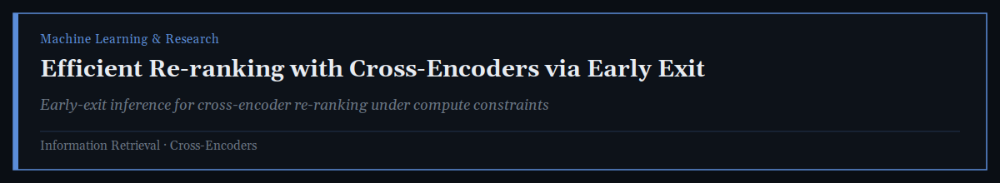

**[Efficient Re-ranking with Cross-Encoders via Early Exit](https://github.com/deepesh1singh/cross-encoder-early-exit-reranking)**

An information retrieval project improving cross-encoder-based document re-ranking efficiency via early-exit techniques, evaluating how early stopping and ranked-list truncation reduce computational cost while maintaining retrieval effectiveness across in-domain and out-of-domain datasets.

</td></tr>
<tr><td>

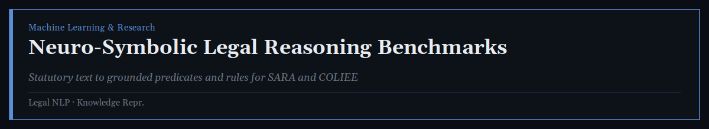

**[Construction of Benchmark Datasets for Neuro-Symbolic Legal Reasoning](https://github.com/deepesh1singh/Multi-Agent-Framework-with-Formalized-Knowledge-Representations-)**

Converts statutory text into machine-interpretable benchmark datasets containing variables, grounded predicates, logical rules, and supporting legal spans. Develops automated benchmark-generation pipelines for the SARA and COLIEE legal datasets with structured JSON/Excel outputs.

</td></tr>
<tr><td>

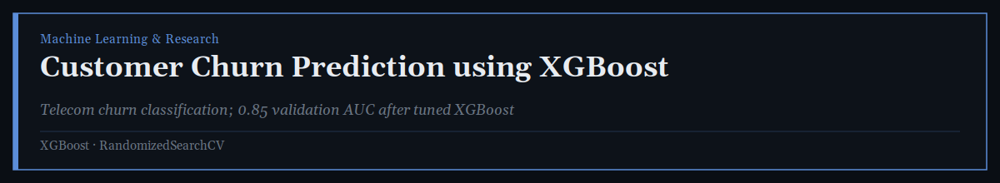

**[Customer Churn Prediction using XGBoost](https://github.com/deepesh1singh/Bias-Variance-Model-)**

A machine learning classification project predicting telecom customer churn through data preprocessing, categorical feature encoding, and hyperparameter tuning with RandomizedSearchCV &mdash; achieving 0.85 validation AUC.

</td></tr>
<tr><td>

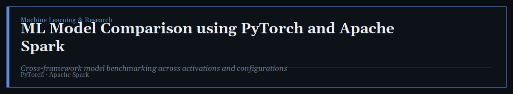

**[Machine Learning Model Comparison using PyTorch and Apache Spark](https://github.com/deepesh1singh/Machine-Learning-Model-Comparison-using-PyTorch-and-Spark)**

Compares machine learning models across PyTorch and Apache Spark, analyzing performance via Mean Squared Error and visualizing the impact of parameters and activation functions through reproducible Jupyter Notebook implementations.

</td></tr>
<tr><td>

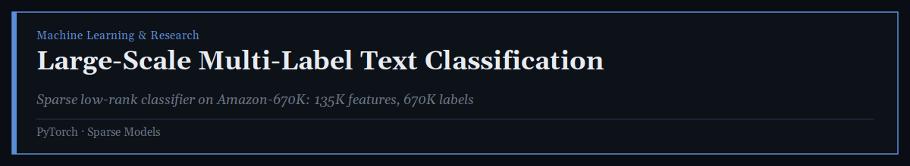

**[Large-Scale Multi-Label Text Classification with PyTorch](https://github.com/deepesh1singh/Large-Scale-Multi-Label-Text-Classification-with-PyTorch)**

A large-scale multi-label text classifier on the Amazon-670K dataset (135,909-dimensional TF-IDF features, 670,091 labels), using a sparse low-rank classifier with rank-128 projection and memory-efficient label chunking, benchmarked across SGD, SGD with Momentum/Nesterov, and Adadelta.

</td></tr>
<tr><td>

**[Review AI &mdash; Intelligent Resume Analyzer & Interview Prep System](https://github.com/deepesh1singh/AI-Powered-Resume-Analyzer-Interview-Prep-Platform)**

A full-stack AI-powered application analyzing a resume against a job description to generate a match score, skill-gap analysis, technical and behavioral interview questions, and a personalized preparation plan, with resume PDF generation and interview-report history.

</td></tr>
<tr><td>

**[AI Job Assistant](https://github.com/deepesh1singh/AI-Job-Assistant)**

A full-stack AI-powered job analysis platform using Sentence Transformers (MPNet) to semantically match job descriptions with resumes, identify matched/missing skills, generate resume insights and cover letters, and track applications through a cross-browser extension for LinkedIn, Indeed, Naukri, and Glassdoor.

</td></tr>
</table>

 

## Systems & Operating Systems

<table>
<tr><td>

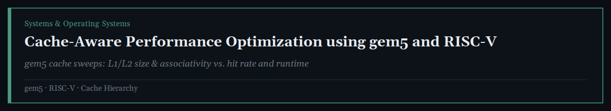

**[Cache-Aware Performance Optimization using gem5 and RISC-V](https://github.com/deepesh1singh/Cache-Aware-Performance-Optimization-using-gem5-and-RISC-V)**

A computer architecture project using gem5 simulation to study how L1/L2 cache size and associativity affect performance. Performs parameter sweeps, analyzes hit rates and Pareto-optimal configurations, and compares simple versus cache-aware chunked merge sort to study memory-access-pattern effects.

</td></tr>
<tr><td>

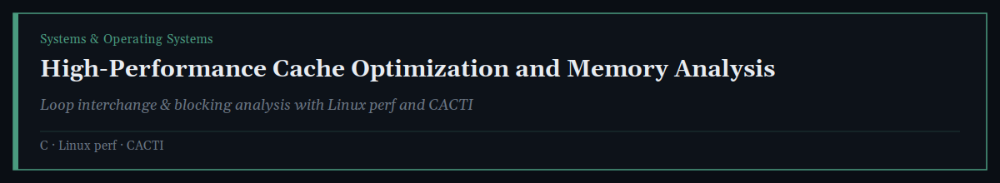

**[High-Performance Cache Optimization and Memory Analysis](https://github.com/deepesh1singh/High-Performance-Cache-Optimization-and-Memory-Analysis)**

A systems performance project evaluating cache optimization and memory hierarchy behavior using C, Linux perf, Python, and CACTI &mdash; analyzing loop interchange and cache blocking, and studying access time and read energy across cache sizes and associativities.

</td></tr>
<tr><td>

**[Virtual Memory Simulation with Approximate LRU](https://github.com/deepesh1singh/Demand-Paging-Page-Replacement-Simulator)**

A C-based virtual memory simulator modeling demand paging and page replacement across 128 concurrent processes, implementing page tables, shared physical frames, page-fault handling, and a 16-bit history-based Approximate LRU policy with a 4-tier frame selection strategy.

</td></tr>
<tr><td>

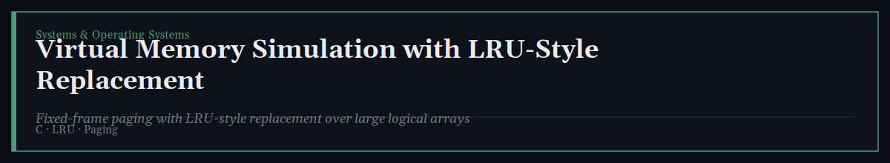

**[Virtual Memory Simulation with LRU-Style Replacement](https://github.com/deepesh1singh/Virtual-Memory-Simulation-with-LRU-Style-Replacement)**

A C-based virtual memory simulator modeling demand paging for processes performing binary searches over large logical arrays, implementing page-fault handling, fixed-frame allocation, and LRU-style replacement under constrained physical memory.

</td></tr>
<tr><td>

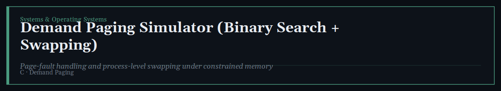

**[Demand Paging Simulator (Binary Search + Swapping)](https://github.com/deepesh1singh/Demand-Paging-Simulator-Binary-Search-Swapping-)**

A C-based demand paging simulator modeling memory management for concurrent processes performing binary searches on paged data, implementing page-fault handling, frame allocation, process-level swapping, and restoration under constrained memory.

</td></tr>
<tr><td>

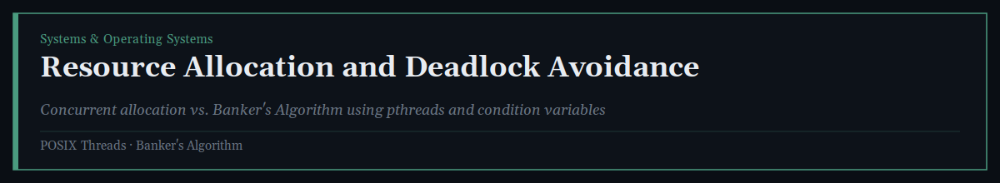

**[Resource Allocation and Deadlock Avoidance](https://github.com/deepesh1singh/Resource-Allocation-and-Deadlock-Avoidance)**

An operating systems project simulating concurrent resource allocation among multiple threads, comparing normal allocation with deadlock avoidance via the Banker's Algorithm using POSIX threads, mutexes, condition variables, and barriers.

</td></tr>
<tr><td>

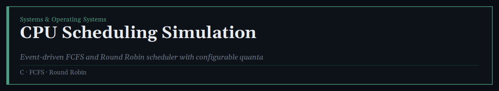

**[CPU Scheduling Simulation (FCFS and Round Robin)](https://github.com/deepesh1singh/CPU-Scheduling-Simulation-FCFS-and-Round-Robin-)**

A C-based event-driven simulator modeling process scheduling with CPU and I/O bursts, implementing FCFS and Round Robin scheduling with configurable time quanta and per-process performance reporting.

</td></tr>
<tr><td>

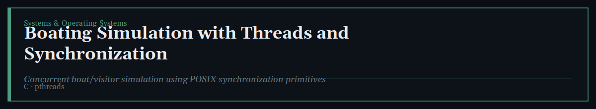

**[Boating Simulation with Threads and Synchronization](https://github.com/deepesh1singh/Boating-Simulation-with-Threads-and-Synchronization)**

A C-based boating center simulation using POSIX threads and synchronization primitives to model concurrent boat and visitor activities, with synchronized visitor-to-boat assignment and controlled concurrent execution across multiple boats.

</td></tr>
<tr><td>

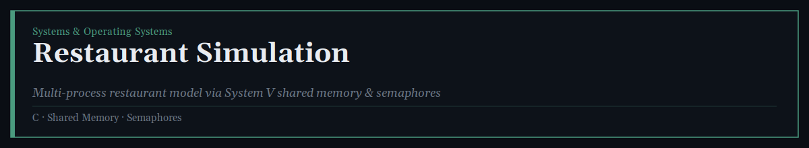

**[Restaurant Simulation (Processes, Shared Memory, Semaphores)](https://github.com/deepesh1singh/Restaurant-Simulation-Processes-Shared-Memory-Semaphores-)**

A C-based restaurant simulation using multiple processes and System V IPC to model concurrent customers, waiters, and cooks, with shared memory for global state and semaphores for synchronization and resource management.

</td></tr>
<tr><td>

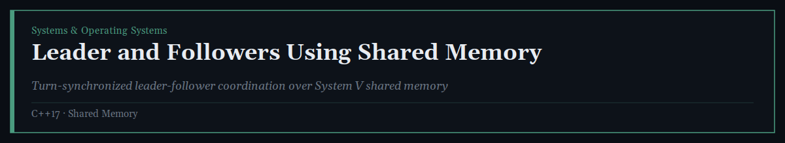

**[Leader and Followers Using Shared Memory](https://github.com/deepesh1singh/Leader-and-Followers-Using-Shared-Memory)**

A C++17 leader-follower coordination system using multiple processes and System V shared memory, implementing turn-by-turn synchronization, shared-state coordination, and termination based on duplicate-sum detection.

</td></tr>
<tr><td>

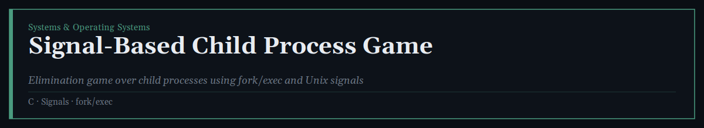

**[Signal-Based Child Process Game](https://github.com/deepesh1singh/Signal-Based-Child-Process-Game)**

A C-based Linux process-management simulation modeling an elimination game using multiple child processes and Unix signals, using fork(), exec(), and SIGUSR1/SIGUSR2 for inter-process communication.

</td></tr>
<tr><td>

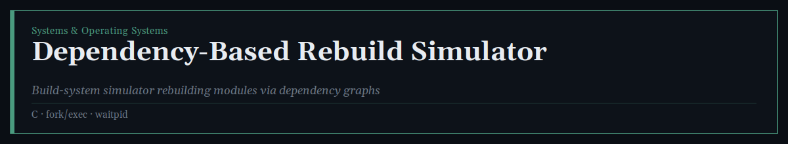

**[Dependency-Based Rebuild Simulator](https://github.com/deepesh1singh/Dependency-Based-Rebuild-Simulator)**

A C-based build-system simulator modeling dependency-driven module rebuilding, generating dependency graphs and recursively rebuilding modules using fork(), exec(), and waitpid(), with file-based state tracking.

</td></tr>
<tr><td>

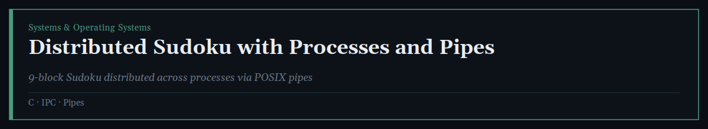

**[Distributed Sudoku with Processes and Pipes](https://github.com/deepesh1singh/Distributed-Sudoku-with-Processes-and-Pipes)**

A C-based interactive Sudoku system distributing the 9 board blocks across independent processes, using POSIX pipes for inter-process communication with a coordinator process routing commands across block processes.

</td></tr>
<tr><td>

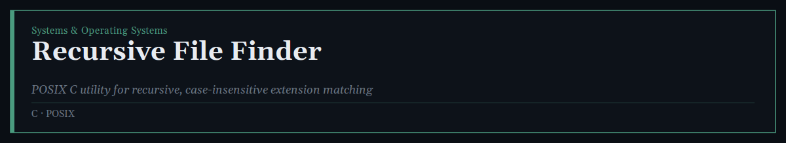

**[Recursive File Finder](https://github.com/deepesh1singh/Recursive-file-finder-by-extension-find-all-)**

A POSIX C utility for recursive directory traversal and case-insensitive file-extension matching, reporting file ownership, size, and full paths for discovered files.

</td></tr>
<tr><td>

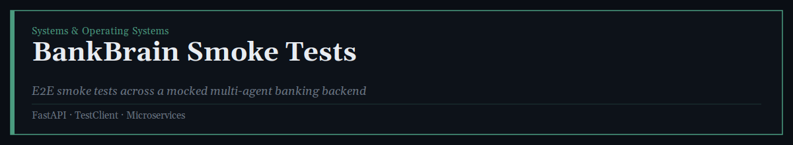

**[BankBrain Smoke Tests](https://github.com/deepesh1singh/BankBrain-Cloud-Ready-Microservices-Banking-Backend)**

An end-to-end testing framework for a cloud-ready, multi-agent banking backend, validating integration across the Mock Bank API, MCP Server, Support Agent, and A2A Gateway using FastAPI TestClient with fully mocked network calls.

</td></tr>
</table>

 

## Networking & Protocols

<table>
<tr><td>

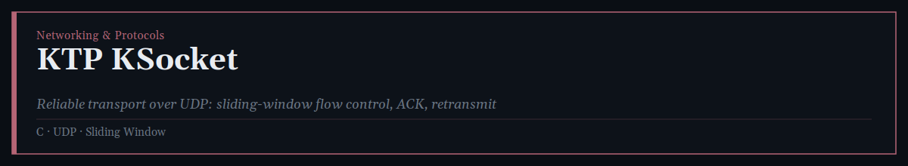

**[KTP KSocket](https://github.com/deepesh1singh/Custom-Network-Transport-Protocol-with-Sliding-Window-over-UDP)**

A reliable transport protocol implemented over UDP in C, providing a socket-like API with sliding-window flow control, ACK-based reliability, timeout retransmissions, and out-of-order packet handling &mdash; using System V shared memory and POSIX threads to coordinate sender/receiver operations under simulated packet loss.

</td></tr>
<tr><td>

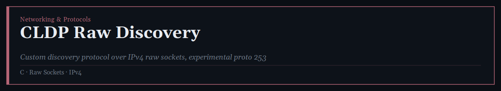

**[CLDP Raw Discovery](https://github.com/deepesh1singh/CLDP-Raw-Discovery)**

A custom network discovery protocol implemented directly over IPv4 raw sockets using experimental IP protocol number 253, defining custom HELLO, QUERY, and RESPONSE messages and handling packet construction and parsing at the IP layer.

</td></tr>
<tr><td>

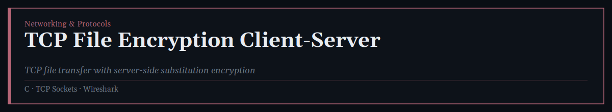

**[TCP File Encryption Client-Server](https://github.com/deepesh1singh/TCP-File-Encryption-Client-Server)**

A C-based client-server application transferring text files over TCP with server-side monoalphabetic substitution encryption, implementing chunked file transfer and encryption-key validation, with Wireshark captures used to inspect network traffic.

</td></tr>
<tr><td>

**[UDP Word-by-Word File Transfer (Client-Server)](https://github.com/deepesh1singh/UDP-Word-by-Word-File-Transfer-Client-Server-)**

A C-based client-server file transfer system using UDP to transmit text files line by line through a custom application-layer protocol, implementing filename requests, sequential data requests, and explicit transfer termination.

</td></tr>
<tr><td>

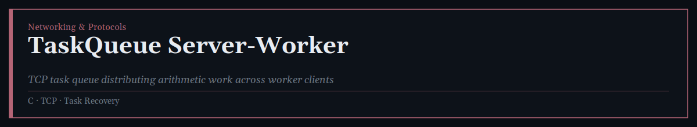

**[TaskQueue Server-Worker](https://github.com/deepesh1singh/TaskQueue-Server-Worker)**

A C-based TCP task queue system distributing arithmetic tasks from a central server to multiple worker clients, supporting concurrent connections, task assignment, and task recovery when a worker disconnects mid-task.

</td></tr>
<tr><td>

**[MiniSMTP](https://github.com/deepesh1singh/MiniSMTP)**

A C-based SMTP-like mail client-server system built on TCP sockets, implementing HELO, MAIL FROM, RCPT TO, and DATA commands with per-user mailbox storage and multi-client handling via POSIX threads.

</td></tr>
</table>

 

## Full-Stack Development

<table>
<tr><td>

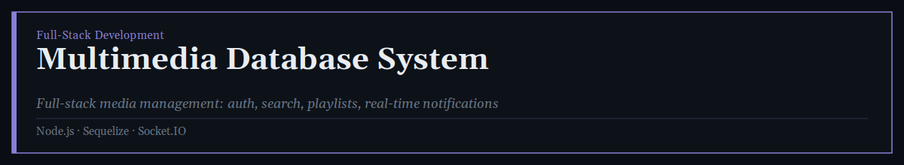

**[Multimedia Database System](https://github.com/deepesh1singh/multimedia-database-system)**

A full-stack system managing books, videos, music, images, and articles using Node.js, Express.js, Sequelize, and SQLite. Implements JWT authentication, secure file uploads, advanced search, playlist management, real-time notifications with Socket.IO, and an admin analytics dashboard.

</td></tr>
<tr><td>

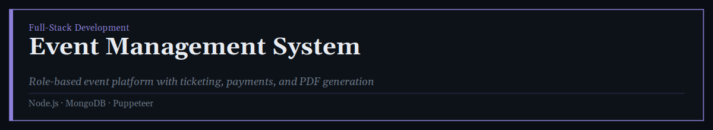

**[Event Management System](https://github.com/deepesh1singh/Event-Management-System)**

A full-stack event management platform with role-based access for managers, vendors, accountants, and customers, supporting ticket booking, payment processing, PDF ticket generation via Puppeteer, and revenue/expenditure reporting.

</td></tr>
<tr><td>

**[JobConnect Platform](https://github.com/deepesh1singh/Job-Plateform)**

A full-stack job recruitment platform connecting candidates and employers &mdash; supporting job discovery, profile management, and application tracking for candidates, and posting, search, and hiring-pipeline management for recruiters. Built with React, TypeScript, Node.js, Express, and MongoDB.

</td></tr>
<tr><td>

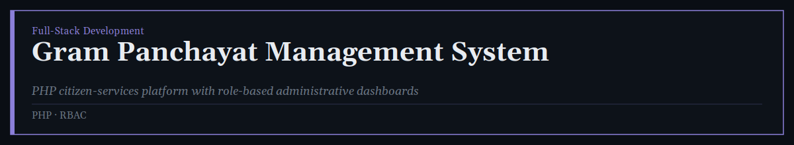

**[Gram Panchayat Management System](https://github.com/deepesh1singh/GRAM-PANCHAYAT-MANAGEMNT-SYSTEM)**

A PHP-based system for digitizing citizen services and administrative workflows, with role-based dashboards for administrators, employees, monitors, and citizens, plus complaint management and structured server-side data operations.

</td></tr>
</table>

 

39 repositories indexed above &middot; organized by primary technical domain

 

## GitHub Activity

  

 

**On the numbers above:** the card shows *total* contributions only. GitHub doesn't expose monthly or weekly contribution counts as a queryable number anywhere &mdash; the closest public equivalent is a 12-week activity chart image, not a figure, so a "monthly" or "weekly" count isn't something any badge can accurately show. The profile-views counter above counts every visit, including your own: GitHub routes all README images through its own proxy (Camo) before they reach the counting service, which strips out who made the request, so no counter &mdash; official or third-party &mdash; can tell your visits apart from anyone else's.
